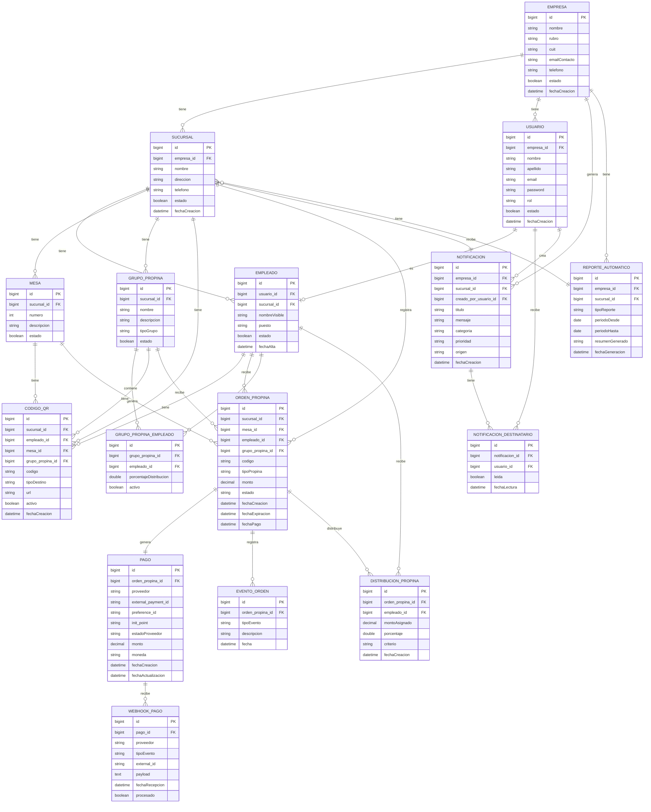

# TipQR - Plataforma de propinas digitales

Plataforma web orientada a comercios de atención al público (bares, restaurantes, cafeterías, hoteles) que permite gestionar propinas digitales mediante códigos QR, integrando una pasarela de pago externa y brindando herramientas administrativas para el seguimiento de las operaciones.

> Trabajo Final Integrador — Tecnicatura Universitaria en Programación — UTN FRC  
> Alumno: Almada Joaquín | Legajo: 412180

---

## Problema

Muchos clientes ya no utilizan efectivo, lo que hace que los empleados de comercios de atención al público pierdan oportunidades de recibir propinas. Además, los comercios no cuentan con una herramienta ordenada para administrar propinas individuales, propinas grupales, mesas atendidas, sucursales, turnos y reportes generales.

## Solución

TipQR permite que el cliente escanee un QR y deje una propina digital de forma rápida, sin necesidad de tener efectivo ni registrarse en la plataforma. El sistema gestiona el ciclo completo: creación de la orden, procesamiento del pago a través de Mercado Pago, conciliación automática y distribución de propinas grupales.

El sistema **no** funciona como billetera virtual ni custodia dinero. El procesamiento del pago es delegado a Mercado Pago en ambiente de prueba.

---

## Stack tecnológico

| Capa | Tecnología |
|---|---|
| Backend | Java 21 + Spring Boot 3.4.3 |
| Frontend | Angular 21 + Tailwind CSS 4 (SSR con @angular/ssr) |
| Base de datos | PostgreSQL 16 |
| Autenticación | Spring Security 6 + JWT (jjwt, HS256, stateless) |
| ORM | Spring Data JPA + Hibernate |
| Email | Spring Mail (SMTP) — verificación de cuenta y notificaciones |
| Captcha | Google reCAPTCHA v2 (registro) |
| Configuración | Variables de entorno vía `.env` (spring-dotenv, gitignored) |
| Documentación API | Swagger / OpenAPI (springdoc) |
| Pagos | Mercado Pago Checkout Pro (ambiente de prueba) + Webhooks (integración vía REST con `RestClient`) |
| Agentes de IA | Google Gemini API (REST, modelo `gemini-flash-lite-latest`) detrás de una interfaz de proveedor agnóstica (`ProveedorIa`) + **respaldo local** cuando no hay clave o el proveedor falla |
| Testing | JUnit 5 + Mockito (223 tests unitarios), H2 en memoria |
| Diseño | Design system propio (tipografía Fraunces + Hanken Grotesk, paleta bordó/rosa/navy) |
| Utilidades | Lombok, ZXing (generación de QR) |

---

## Estado del proyecto

Funcionalidades efectivamente implementadas hasta la fecha:

### ✅ Autenticación y estructura base (Sprint 1)
- Login con JWT stateless (HS256) y BCrypt para el hash de contraseñas.
- Control de acceso por rol (`SUPERADMIN`, `DUENO`, `ENCARGADO`, `EMPLEADO`) con `@PreAuthorize` en el backend y *guards* + interceptor en el frontend.
- Manejo centralizado de errores con cuerpo uniforme (`ErrorResponse`): 400, 401, 403, 404, 409.
- Frontend base: layout con sidebar, dashboards diferenciados por rol.
- Las 16 entidades JPA del dominio modeladas y mapeadas.

### ✅ Registro self-service con validación (onboarding)
- **Stepper de 3 pasos**: datos del usuario (con reCAPTCHA y verificación de email real por SMTP), datos del comercio, y carga de documentos (DNI frente/dorso y selfie como imagen, constancia AFIP como PDF).
- Estados de cuenta: `CREADA → VERIFICADA → PENDIENTE_VALIDACION → APROBADA / RECHAZADA`. El login pleno requiere `APROBADA`.
- Validación de unicidad de email, CUIT y DNI.
- **Rechazo recuperable:** si el superadmin rechaza la cuenta, el dueño recibe un email con el motivo y un enlace para **corregir y reenviar** la solicitud (ver [Mejoras adicionales](#-mejoras-adicionales)).

### ✅ Panel del superadmin
- Rol `SUPERADMIN` único (sembrado). Revisa las solicitudes de alta pendientes con todos los datos y **previsualiza los documentos** (imágenes y PDF) sin descargarlos.
- Aprueba o rechaza (con motivo); en ambos casos se notifica al dueño por email.
- **Dos bandejas con filtro por estado** (Pendientes / Aprobadas / Rechazadas): *Cuentas* de dueños y *Empresas* nuevas (altas de dueños ya validados). Ver [Mejoras adicionales](#-mejoras-adicionales).

### ✅ Gestión operativa — ABM completo (Sprint 2)
Todo con **aislamiento multi-tenant** (cada dueño accede solo a los datos de su empresa) y verificado de punta a punta:
- **Empresa** (Mi empresa): ver / editar / activar-desactivar, CUIT único.
- **Sucursales**: ABM, nombre único por empresa, no se desactiva con empleados activos.
- **Empleados**: ABM con alta automática de su usuario (rol EMPLEADO + contraseña temporal por email), filtrable por sucursal.
- **Mesas**: ABM, número único por sucursal.
- **Grupos de propina**: ABM, nombre único por sucursal.
- **Asignación de empleados a grupos**: relación N:N (solo empleados de la misma sucursal, sin duplicar).
- **Panel del encargado**: un empleado puede marcarse como encargado; ve en solo lectura los empleados, mesas y grupos de su sucursal.

### ✅ Del QR a la propina pagada (Sprint 3)

#### Órdenes de propina (modelo, estados y eventos)
- Cada propina es una **orden** con código único, tipo, monto, estado y vencimiento.
- Ciclo de estados: `CREADA → PENDIENTE_PAGO → PAGADA / RECHAZADA / CANCELADA / EXPIRADA`. Cada cambio registra un **EventoOrden** (trazabilidad completa).
- **Expiración automática**: una tarea programada (`@Scheduled`) expira las órdenes sin pagar vencidas. El plazo es configurable.
- Endpoint público de consulta de estado, usado por la pantalla pública mientras espera el pago.

#### Generación de códigos QR
- Se genera **automáticamente** un QR único por mesa y por empleado al darlos de alta (idempotente).
- Cada QR apunta a la pantalla pública de propina. **Descarga e previsualización del PNG** en el panel de administración (con regeneración del código).

#### Pantalla pública de propina (sin login)
- El cliente escanea el QR, ve el destino (mesa/empleado) y el comercio, elige un **monto preestablecido o libre** y continúa al pago. Pantalla mobile-first.

#### Integración con Mercado Pago (Checkout Pro)
- Al confirmar el monto se crea la **preferencia de pago** y se redirige al Checkout Pro; la orden pasa a `PENDIENTE_PAGO`.
- **Webhook** que recibe la notificación de Mercado Pago, consulta el pago y **concilia** la orden automáticamente (`approved → PAGADA`, `rejected → RECHAZADA`), registrando el `Pago` y el `WebhookPago`.
- **Validación de firma** (`x-signature`, HMAC-SHA256) implementada y configurable: se valida en producción y se desactiva en el sandbox (los pagos de usuarios de prueba se firman con un secreto no expuesto).
- Pantalla de resultado del pago con consulta del estado (aprobado / rechazado / pendiente).

### ✅ Conciliación, distribución, dashboards y reportes (Sprint 4)

#### Distribución de propinas grupales
- Cuando una propina **grupal** se paga, se reparte automáticamente entre los miembros activos del grupo.
- Dos criterios configurables por grupo: **equitativo** (partes iguales) o **por porcentaje** (cada miembro con su %).
- El reparto es **exacto al centavo** (método de mayor resto): los centavos que no dividen justo se asignan sin que la suma cambie respecto del total. Cada parte queda registrada como `DistribucionPropina` y notifica al empleado.

#### Dashboards y reportes
- **Dashboard del empleado:** historial de propinas recibidas (individuales + su parte de las grupales), unificado y ordenado por fecha, con total.
- **Dashboard del dueño:** total recaudado, ticket promedio, cantidad de propinas y desglose por sucursal (KPIs).
- **Ranking de empleados** por propinas recibidas (individuales + parte grupal).
- **Reporte por período** (rango de fechas).

### ✅ Comunicaciones internas y agentes de IA (Sprint 5)

#### Notificaciones internas
- El dueño o encargado envía **avisos** a los empleados, **segmentando el destinatario**: toda la empresa, una **sucursal**, un **turno** (el equipo del turno) o un **rol** (encargados / empleados). Con categoría y prioridad.
- Cada empleado tiene su **bandeja** con badge de no leídas y marcado de lectura. Se puede **buscar por texto, filtrar por rango de fechas, ordenar por fecha y eliminar** avisos.
- Origen de la notificación: `MANUAL` (persona), `SISTEMA` (automática, ej. "recibiste una propina") o `AGENTE` (redactada con IA).

#### Agente de notificaciones internas (IA)
- Convierte una **instrucción informal** ("recordá al turno noche que mañana entran a las 18") en un **borrador estructurado** (título, mensaje y categoría).
- **Control humano:** el borrador se revisa y edita antes de enviarse. Al confirmar, la notificación queda con origen `AGENTE`.

#### Agente de reportes automáticos (IA)
- Genera un **resumen ejecutivo en lenguaje natural** a partir de los datos de propinas (panorama general, desempeño por sucursal, empleados destacados y una recomendación/alerta).
- Se **persiste** (`ReporteAutomatico`) para consultar el historial desde la sección *Reportes IA*, con **búsqueda por texto, filtro por fecha, orden por fecha y eliminación**.

> Ambos agentes usan Google Gemini a través de una **interfaz de proveedor agnóstica** (`ProveedorIa`): cambiar de proveedor es una implementación nueva sin tocar los servicios. Si no hay clave configurada o el proveedor falla, ambos aplican una **redacción/resumen local de respaldo**, de modo que la funcionalidad (y la demo) sigue operativa sin depender de la red.

### ✅ Mejoras adicionales
- **Un dueño puede administrar varias empresas** (multi-empresa): modelo de *empresa activa* — el dueño lista sus empresas, crea nuevas y **cambia** cuál está gestionando; todo el sistema queda acotado a la empresa activa.
- **Alta de empresa nueva con validación del superadmin.** Cuando un dueño ya validado da de alta otra empresa, se abre un **stepper en modal** (datos del comercio + constancia de AFIP en PDF) y la empresa nace en estado **PENDIENTE**: no se puede gestionar hasta que el superadmin la apruebe. No se le vuelve a pedir DNI/selfie (la identidad del dueño ya está validada). Al aprobar/rechazar, el dueño recibe una **notificación interna** con el motivo.
- **Corregir y reenviar (empresa rechazada).** Una empresa rechazada muestra una **alerta con el motivo** y un botón *"Corregir y reenviar"* que reabre el stepper precargado: se editan los datos y/o se reemplaza la constancia y vuelve a **PENDIENTE** para una nueva revisión.
- **Corregir y reenviar (cuenta rechazada).** Como una cuenta rechazada no puede iniciar sesión, el rechazo llega **por email con el motivo y un botón** que abre una pantalla de corrección (`/registro/corregir?token=…`): permite editar los datos personales y del comercio, reemplazar documentos y **reenviar la solicitud** a validación, sin intervención manual.
- **Filtros de estado en el panel del superadmin.** Tanto en *Cuentas* como en *Empresas* se puede filtrar por **Pendientes / Aprobadas / Rechazadas**. La solapa de cuentas lista **solo dueños** (los que pasan por el auto-registro con documentos), no empleados.
- **Edición completa de "Mi empresa".** El dueño puede editar **todos** los datos cargados en el registro (nombre de fantasía, provincia, calle, número, etc.) y **ver/reemplazar los documentos** (constancia AFIP y fotos), con previsualización.
- **Fotos en el alta de empleados.** Al crear un empleado se pueden cargar **DNI frente, DNI dorso y selfie** (imágenes), con previsualización y reemplazo desde la edición. Quedan como registro/control del dueño (el empleado no requiere validación del superadmin: lo respalda el dueño).
- **Buscador de dirección con mapa en sucursales.** El campo de dirección tiene **autocompletado** (OpenStreetMap / Nominatim) y un **mapa** (Leaflet) a la derecha con un pin que se puede arrastrar o fijar tocando el mapa (con *reverse geocoding*). Se guardan las **coordenadas** (latitud/longitud) de la sucursal. Sin API key ni facturación.
- **Botón "Ir al pago" en Códigos QR.** Cada QR tiene un acceso directo que abre su pantalla pública de propina en otra pestaña, para probar el flujo de pago sin escanear.

#### Robustez del cobro
- **Conciliación de pagos a prueba de duplicados.** El webhook y la URL de retorno de Mercado Pago llegan casi simultáneos (y MP repite el webhook). La conciliación toma un **lock de fila** (`SELECT … FOR UPDATE`) para serializarse: la orden se marca pagada, se reparte y se notifica **una sola vez** (antes podía notificar/repartir dos veces).
- **Emisor de notificaciones automáticas.** Los avisos de sistema (ej. "¡Recibiste una propina!") figuran como **"De TipQR"** y no a nombre del dueño, en coherencia con que no aparecen en la solapa *Enviadas* de nadie.

### ✅ Diseño
- Rediseño editorial completo de toda la interfaz (tipografía Fraunces + Hanken Grotesk, paleta bordó/rosa/navy, superficies crema) con un design system propio en `styles.css`.

### ✅ Calidad
- **223 tests unitarios** (JUnit 5 + Mockito) cubriendo seguridad, servicios (órdenes, QR, pagos, distribución, notificaciones, agentes de IA con mock del proveedor, multi-empresa), controladores, entidades y DTOs.

---

## Módulos del sistema

- **Autenticación y roles:** dueño/administrador, encargado y empleado. El cliente que escanea el QR no requiere login.
- **Gestión operativa:** empresa, sucursales, empleados, mesas, turnos y grupos de propina.
- **QR y pantalla pública:** generación de QR o links de propina por empleado, mesa, sucursal o grupo. Pantalla pública para que el cliente elija tipo de propina, monto y continúe al pago.
- **Órdenes de propina:** cada propina genera una orden con identificador único, tipo, monto, estado, vencimiento e historial de eventos.
- **Propinas individuales:** asociadas a un empleado específico.
- **Propinas grupales:** asociadas a un equipo, mesa, turno o sucursal, con distribución **equitativa o por porcentaje configurable** entre los empleados del grupo.
- **Integración de pagos:** preferencias de pago con Mercado Pago, recepción de webhooks y conciliación automática del estado de la orden.
- **Dashboard del empleado:** propinas recibidas, mesas, QR personal y notificaciones.
- **Dashboard administrativo:** indicadores generales, KPIs, ranking y reportes sin exponer detalle sensible de cada empleado.
- **Multi-empresa:** un mismo dueño puede administrar varias empresas y conmutar cuál está gestionando (empresa activa).
- **Comunicaciones internas:** envío manual de avisos, segmentando por empresa, sucursal, turno o rol.
- **Agente de notificaciones internas:** transforma instrucciones informales en comunicados claros y estructurados, con confirmación humana.
- **Agente de reportes automáticos:** genera resúmenes operativos de propinas, actividad, ranking y alertas.

### Fuera del alcance

Billetera virtual propia, custodia de dinero, liquidaciones bancarias reales, transferencias entre usuarios, facturación electrónica, aplicación mobile nativa, chat en tiempo real y decisiones autónomas de IA sin confirmación humana.

---

## Modelo de base de datos

### Diagrama general

```
EMPRESA
  ├── SUCURSAL
  │     ├── EMPLEADO
  │     │      └── USUARIO
  │     │
  │     ├── MESA
  │     │
  │     ├── GRUPO_PROPINA
  │     │      └── GRUPO_PROPINA_EMPLEADO
  │     │
  │     ├── CODIGO_QR
  │     │
  │     ├── ORDEN_PROPINA
  │     │      ├── PAGO
  │     │      │    └── WEBHOOK_PAGO
  │     │      ├── EVENTO_ORDEN
  │     │      └── DISTRIBUCION_PROPINA
  │     │
  │     └── NOTIFICACION
  │            └── NOTIFICACION_DESTINATARIO
  │
  └── REPORTE_AUTOMATICO

USUARIO
  └── NOTIFICACION_DESTINATARIO
```

### Entidades

#### Usuario
Persona que accede al sistema (superadmin, dueño, encargado o empleado).

| Campo | Tipo | Descripción |
|---|---|---|
| id | Long | PK |
| nombre | String | Nombre del usuario |
| apellido | String | Apellido del usuario |
| email | String | Email único |
| password | String | Contraseña encriptada (BCrypt) |
| telefono | String | Teléfono |
| cuit | String | CUIT (único) |
| dni | String | DNI (único) |
| rol | Enum | SUPERADMIN, DUENO, ENCARGADO, EMPLEADO |
| estadoCuenta | Enum | CREADA, VERIFICADA, PENDIENTE_VALIDACION, APROBADA, RECHAZADA |
| emailVerificado | Boolean | Si verificó su email |
| emailToken | String | Token de verificación / registro (nullable) |
| empresa_id | Long | FK → Empresa (nullable; el superadmin no tiene) |
| estado | Boolean | Activo/Inactivo |
| fechaCreacion | LocalDateTime | Fecha de alta |

**Relaciones:** `Usuario N → 1 Empresa`, `Usuario 1 → 1 Empleado`

#### DocumentoRegistro
Documento adjunto por el dueño en el registro (DNI frente/dorso, selfie, constancia AFIP). El binario se guarda en la base.

| Campo | Tipo | Descripción |
|---|---|---|
| id | Long | PK |
| usuario_id | Long | FK → Usuario |
| tipo | Enum | DNI_FRENTE, DNI_DORSO, SELFIE, CONSTANCIA_AFIP |
| nombreArchivo | String | Nombre original del archivo |
| contentType | String | Tipo MIME (image/* o application/pdf) |
| datos | byte[] | Contenido binario |
| fechaCarga | LocalDateTime | Fecha de carga |

---

#### Empresa
Comercio principal registrado en la plataforma.

| Campo | Tipo | Descripción |
|---|---|---|
| id | Long | PK |
| nombre | String | Razón social / nombre del comercio |
| nombreFantasia | String | Nombre de fantasía (opcional) |
| rubro | String | Rubro del negocio |
| cuit | String | CUIT del comercio (único) |
| provincia | String | Provincia |
| calle | String | Calle |
| numeracion | String | Numeración |
| emailContacto | String | Email de contacto |
| telefono | String | Teléfono |
| propietario_usuario_id | Long | FK → Usuario (dueño propietario; un dueño puede tener varias empresas) |
| estado | Boolean | Activo/Inactivo |
| fechaCreacion | LocalDateTime | Fecha de alta |

**Relaciones:** `Empresa 1 → N Sucursal`, `Empresa 1 → N Usuario`, `Empresa N → 1 Usuario (propietario)`

---

#### Sucursal
Local físico de una empresa.

| Campo | Tipo | Descripción |
|---|---|---|
| id | Long | PK |
| empresa_id | Long | FK → Empresa |
| nombre | String | Nombre de la sucursal |
| direccion | String | Dirección física |
| telefono | String | Teléfono |
| estado | Boolean | Activo/Inactivo |
| fechaCreacion | LocalDateTime | Fecha de alta |

**Relaciones:** `Sucursal N → 1 Empresa`, `Sucursal 1 → N Empleado`, `Sucursal 1 → N Mesa`, `Sucursal 1 → N GrupoPropina`, `Sucursal 1 → N OrdenPropina`

---

#### Empleado
Persona que trabaja en el comercio y puede recibir propinas.

| Campo | Tipo | Descripción |
|---|---|---|
| id | Long | PK |
| usuario_id | Long | FK → Usuario |
| sucursal_id | Long | FK → Sucursal |
| nombreVisible | String | Nombre que ve el cliente en el QR |
| puesto | String | Puesto o cargo |
| estado | Boolean | Activo/Inactivo |
| fechaAlta | LocalDateTime | Fecha de alta |

**Relaciones:** `Empleado N → 1 Sucursal`, `Empleado 1 → 1 Usuario`, `Empleado 1 → N OrdenPropina`, `Empleado N → N GrupoPropina`

---

#### Mesa
Mesa física de un local.

| Campo | Tipo | Descripción |
|---|---|---|
| id | Long | PK |
| sucursal_id | Long | FK → Sucursal |
| numero | Integer | Número de mesa |
| descripcion | String | Descripción opcional |
| estado | Boolean | Activo/Inactivo |

**Relaciones:** `Mesa N → 1 Sucursal`, `Mesa 1 → N OrdenPropina`

---

#### GrupoPropina
Equipo o grupo que recibe propinas de forma conjunta (ej: "Equipo Turno Noche", "Barra").

| Campo | Tipo | Descripción |
|---|---|---|
| id | Long | PK |
| sucursal_id | Long | FK → Sucursal |
| nombre | String | Nombre del grupo |
| descripcion | String | Descripción |
| tipoGrupo | String | Tipo de agrupación |
| tipoDistribucion | Enum | EQUITATIVO, PORCENTAJE (criterio de reparto de las propinas grupales) |
| estado | Boolean | Activo/Inactivo |

**Relaciones:** `GrupoPropina N → 1 Sucursal`, `GrupoPropina N → N Empleado`

---

#### GrupoPropinaEmpleado
Tabla intermedia para la relación Empleado ↔ GrupoPropina.

| Campo | Tipo | Descripción |
|---|---|---|
| id | Long | PK |
| grupo_propina_id | Long | FK → GrupoPropina |
| empleado_id | Long | FK → Empleado |
| porcentajeDistribucion | Double | Porcentaje (opcional, por defecto equitativo) |
| activo | Boolean | Activo/Inactivo |

---

#### CodigoQR
QR o link asociado a un empleado, mesa, grupo o sucursal.

| Campo | Tipo | Descripción |
|---|---|---|
| id | Long | PK |
| codigo | String | Código único |
| tipoDestino | Enum | EMPLEADO, MESA, GRUPO, SUCURSAL |
| empleado_id | Long | FK → Empleado (nullable) |
| mesa_id | Long | FK → Mesa (nullable) |
| grupo_propina_id | Long | FK → GrupoPropina (nullable) |
| sucursal_id | Long | FK → Sucursal |
| url | String | URL a la que apunta el QR |
| activo | Boolean | Activo/Inactivo |
| fechaCreacion | LocalDateTime | Fecha de creación |

---

#### OrdenPropina
Entidad central del sistema. Representa una intención de propina desde su creación hasta el pago.

| Campo | Tipo | Descripción |
|---|---|---|
| id | Long | PK |
| codigo | String | Identificador único de la orden |
| sucursal_id | Long | FK → Sucursal |
| mesa_id | Long | FK → Mesa (nullable) |
| empleado_id | Long | FK → Empleado (nullable si es grupal) |
| grupo_propina_id | Long | FK → GrupoPropina (nullable si es individual) |
| tipoPropina | Enum | INDIVIDUAL, GRUPAL |
| monto | BigDecimal | Monto de la propina |
| estado | Enum | CREADA, PENDIENTE_PAGO, PAGADA, RECHAZADA, CANCELADA, EXPIRADA |
| fechaCreacion | LocalDateTime | Fecha de creación |
| fechaExpiracion | LocalDateTime | Vencimiento de la orden |
| fechaPago | LocalDateTime | Fecha en que se confirmó el pago |

**Regla:** Si `tipoPropina = INDIVIDUAL` → tiene `empleado_id`. Si `tipoPropina = GRUPAL` → tiene `grupo_propina_id`.

**Relaciones:** `OrdenPropina 1 → 1 Pago`, `OrdenPropina 1 → N EventoOrden`, `OrdenPropina 1 → N DistribucionPropina`

---

#### Pago
Información del pago externo procesado con Mercado Pago.

| Campo | Tipo | Descripción |
|---|---|---|
| id | Long | PK |
| orden_propina_id | Long | FK → OrdenPropina |
| proveedor | Enum | MERCADO_PAGO |
| external_payment_id | String | ID devuelto por Mercado Pago |
| preference_id | String | ID de preferencia MP |
| init_point | String | URL de pago de MP |
| estadoProveedor | String | approved / pending / rejected |
| monto | BigDecimal | Monto del pago |
| moneda | String | ARS |
| fechaCreacion | LocalDateTime | Fecha de creación |
| fechaActualizacion | LocalDateTime | Última actualización |

**Relaciones:** `Pago 1 → 1 OrdenPropina`, `Pago 1 → N WebhookPago`

---

#### WebhookPago
Notificaciones recibidas desde Mercado Pago. Permite trazabilidad completa.

| Campo | Tipo | Descripción |
|---|---|---|
| id | Long | PK |
| pago_id | Long | FK → Pago |
| proveedor | String | Proveedor del webhook |
| tipoEvento | String | Tipo de evento recibido |
| external_id | String | ID externo del evento |
| payload | JSONB | Cuerpo completo del webhook |
| fechaRecepcion | LocalDateTime | Fecha de recepción |
| procesado | Boolean | Si fue procesado |

---

#### DistribucionPropina
Registro de cómo se distribuyó una propina grupal entre los empleados del grupo.

| Campo | Tipo | Descripción |
|---|---|---|
| id | Long | PK |
| orden_propina_id | Long | FK → OrdenPropina |
| empleado_id | Long | FK → Empleado |
| montoAsignado | BigDecimal | Monto asignado al empleado |
| porcentaje | Double | Porcentaje asignado |
| criterio | String | Criterio de distribución (equitativo, etc.) |
| fechaCreacion | LocalDateTime | Fecha de distribución |

---

#### EventoOrden
Historial de cambios de estado de una orden de propina.

| Campo | Tipo | Descripción |
|---|---|---|
| id | Long | PK |
| orden_propina_id | Long | FK → OrdenPropina |
| tipoEvento | Enum | ORDEN_CREADA, PREFERENCIA_MP_GENERADA, PAGO_CONFIRMADO, ORDEN_PAGADA, ORDEN_RECHAZADA, ORDEN_CANCELADA, ORDEN_EXPIRADA, DISTRIBUCION_GENERADA |
| descripcion | String | Descripción del evento |
| fecha | LocalDateTime | Fecha del evento |

---

#### Notificacion
Aviso interno enviado a los empleados, segmentado por empresa, sucursal, turno o rol.

| Campo | Tipo | Descripción |
|---|---|---|
| id | Long | PK |
| empresa_id | Long | FK → Empresa |
| sucursal_id | Long | FK → Sucursal (nullable) |
| creado_por_usuario_id | Long | FK → Usuario |
| titulo | String | Título del aviso |
| mensaje | String | Cuerpo del mensaje |
| categoria | Enum | OPERATIVA, STOCK, HORARIO, PAGOS, GENERAL |
| prioridad | Enum | BAJA, MEDIA, ALTA |
| origen | Enum | MANUAL (persona), SISTEMA (automática), AGENTE (redactada con IA) |
| fechaCreacion | LocalDateTime | Fecha de creación |

**Relaciones:** `Notificacion 1 → N NotificacionDestinatario`

---

#### NotificacionDestinatario
Destinatarios de una notificación y su estado de lectura.

| Campo | Tipo | Descripción |
|---|---|---|
| id | Long | PK |
| notificacion_id | Long | FK → Notificacion |
| usuario_id | Long | FK → Usuario |
| leida | Boolean | Si fue leída |
| fechaLectura | LocalDateTime | Fecha en que la leyó |

---

#### ReporteAutomatico
Resumen ejecutivo generado por el **agente de reportes (IA)** a partir de los datos de propinas, persistido para consultarlo en la sección *Reportes IA*.

| Campo | Tipo | Descripción |
|---|---|---|
| id | Long | PK |
| empresa_id | Long | FK → Empresa |
| sucursal_id | Long | FK → Sucursal (nullable) |
| tipoReporte | Enum | DIARIO, SEMANAL, MENSUAL, PERSONALIZADO |
| periodoDesde | LocalDate | Inicio del período (nullable) |
| periodoHasta | LocalDate | Fin del período (nullable) |
| titulo | String | Título del reporte |
| resumenGenerado | String | Texto del resumen (lenguaje natural) |
| totalRecaudado | BigDecimal | Métrica: total recaudado (snapshot) |
| cantidadPropinas | Integer | Métrica: cantidad de propinas |
| ticketPromedio | BigDecimal | Métrica: ticket promedio |
| generadoPorIa | Boolean | True si lo redactó la IA; false si se usó el respaldo local |
| fechaGeneracion | LocalDateTime | Fecha de generación |

---

## Diagrama Entidad-Relación



---

## API REST

Base URL: `http://localhost:8080`. Todos los endpoints (excepto los públicos) requieren el header `Authorization: Bearer <token>`.

### Endpoints públicos

| Método | Endpoint | Descripción |
|---|---|---|
| `GET` | `/api/health` | Health check del servicio |
| `POST` | `/api/auth/login` | Login. Devuelve token JWT + datos del usuario |
| `POST` | `/api/registro/paso1` | Alta del usuario + captcha + envío de email de verificación |
| `GET` | `/api/registro/verificar?token=` | Verifica el email (link del correo) |
| `GET` | `/api/registro/estado?token=` | Estado del registro (polling del wizard) |
| `POST` | `/api/registro/paso2?token=` | Datos del comercio |
| `POST` | `/api/registro/documentos?token=&tipo=` | Subida de documento (multipart) |
| `POST` | `/api/registro/finalizar?token=` | Finaliza → cuenta en PENDIENTE_VALIDACION |
| `GET` | `/api/registro/resumen?token=` | Datos del registro para retomarlo tras un rechazo |
| `PUT` | `/api/registro/datos?token=` | Corregir datos personales al retomar un registro rechazado |
| `GET` | `/api/public/qr/{codigo}` | Resuelve el QR escaneado (destino + comercio) |
| `POST` | `/api/public/qr/{codigo}/ordenes` | Crea la orden de propina con el monto elegido |
| `POST` | `/api/public/ordenes/{codigo}/pago` | Inicia el pago: crea la preferencia de Mercado Pago |
| `GET` | `/api/public/pagos/retorno?orden=` | Retorno del Checkout Pro (redirige al frontend) |
| `POST` | `/api/public/pagos/webhook` | Webhook de Mercado Pago (conciliación de la orden) |
| `GET` | `/api/ordenes/{codigo}/estado` | Estado de una orden (polling de la pantalla pública) |
| `GET` | `/swagger-ui.html` | Documentación interactiva OpenAPI |

### Perfil (usuario autenticado)

| Método | Endpoint | Rol requerido |
|---|---|---|
| `GET` | `/api/perfil` | Cualquier autenticado |
| `GET` | `/api/admin/perfil` | `DUENO`, `ENCARGADO` |
| `GET` | `/api/empleado/perfil` | `EMPLEADO` |

> Todas las entidades operativas están **acotadas a la empresa del usuario autenticado** (multi-tenant): un recurso de otra empresa responde `404`. La lectura es para `DUENO` y `ENCARGADO`; la escritura, solo `DUENO`.

### Mi empresa

| Método | Endpoint | Descripción |
|---|---|---|
| `GET` | `/api/empresas/mia` | Empresa activa del usuario |
| `GET` / `PUT` | `/api/empresas/{id}` | Ver / editar (propia) |
| `PATCH` | `/api/empresas/{id}/estado?estado=` | Activar / desactivar |
| `GET` | `/api/empresas/mias` | Todas las empresas del dueño (marca la activa) — multi-empresa |
| `POST` | `/api/empresas` | Dar de alta una empresa adicional (queda **PENDIENTE** de validación) |
| `POST` | `/api/empresas/{id}/constancia` | Subir la constancia AFIP (PDF) de la empresa nueva |
| `POST` | `/api/empresas/{id}/reenviar` | Reenviar a validación una empresa rechazada (tras corregirla) |
| `PUT` | `/api/empresas/{id}/activar` | Cambiar la empresa que se está gestionando (debe estar aprobada) |
| `GET` / `POST` | `/api/perfil/documentos` | Documentos de la empresa del dueño: estado y subida/reemplazo |
| `GET` | `/api/perfil/documentos/{tipo}/archivo` | Binario de un documento (previsualización) |

### Sucursales · Mesas · Grupos de propina

Mismo patrón ABM (`GET` lista con filtro `?sucursalId=`, `GET /{id}`, `POST`, `PUT /{id}`, `PATCH /{id}/estado`):

| Recurso | Base |
|---|---|
| Sucursales | `/api/sucursales` |
| Mesas | `/api/mesas` |
| Grupos de propina | `/api/grupos-propina` |

### Empleados

| Método | Endpoint | Descripción |
|---|---|---|
| `GET` | `/api/empleados?sucursalId=` | Listar (filtrable por sucursal) |
| `POST` | `/api/empleados` | Crear (alta automática de usuario + contraseña temporal) |
| `PUT` | `/api/empleados/{id}` | Editar |
| `PATCH` | `/api/empleados/{id}/estado?estado=` | Activar / desactivar |
| `PATCH` | `/api/empleados/{id}/encargado?valor=` | Marcar / quitar encargado |
| `GET` / `POST` | `/api/empleados/{id}/documentos` | Fotos del empleado (DNI frente/dorso, selfie): estado y subida |
| `GET` | `/api/empleados/{id}/documentos/{tipo}/archivo` | Binario de una foto (previsualización) |
| `GET` | `/api/empleados/mi-sucursal` | Sucursal del usuario logueado (panel del encargado) |

> Las **sucursales** guardan además **latitud/longitud** (elegidas con el buscador de dirección + mapa de OpenStreetMap).

### Miembros de un grupo de propina

| Método | Endpoint | Descripción |
|---|---|---|
| `GET` | `/api/grupos-propina/{id}/empleados` | Listar miembros (con su porcentaje) |
| `POST` | `/api/grupos-propina/{id}/empleados` | Agregar empleado (de la misma sucursal) |
| `DELETE` | `/api/grupos-propina/{id}/empleados/{empleadoId}` | Remover empleado |

### Distribución del grupo (`DUENO`)

| Método | Endpoint | Descripción |
|---|---|---|
| `PUT` | `/api/grupos-propina/{id}/porcentajes` | Configurar el % de cada miembro (deben sumar 100) → modo PORCENTAJE |
| `PUT` | `/api/grupos-propina/{id}/equitativo` | Volver a reparto equitativo |

### Códigos QR (`DUENO`, `ENCARGADO`)

| Método | Endpoint | Descripción |
|---|---|---|
| `GET` | `/api/qr?sucursalId=` | Listar QR (filtrable por sucursal) |
| `GET` | `/api/qr/{id}/imagen` | Imagen PNG del QR (previsualizar / descargar) |
| `POST` | `/api/qr/{id}/regenerar` | Regenerar el código del QR (`DUENO`) |

### Dashboards y reportes

| Método | Endpoint | Rol | Descripción |
|---|---|---|---|
| `GET` | `/api/empleado/propinas` | `EMPLEADO`, `ENCARGADO` | Historial de propinas del empleado (individuales + parte grupal) |
| `GET` | `/api/dashboard/resumen` | `DUENO` | KPIs: total, ticket promedio, cantidad, desglose por sucursal |
| `GET` | `/api/dashboard/ranking` | `DUENO` | Ranking de empleados por propinas recibidas |
| `GET` | `/api/dashboard/reporte?desde=&hasta=` | `DUENO` | Reporte de propinas pagadas en un rango de fechas |
| `POST` | `/api/dashboard/reportes-ia` | `DUENO` | Genera con IA un resumen ejecutivo y lo guarda |
| `GET` | `/api/dashboard/reportes-ia` | `DUENO` | Historial de reportes generados |
| `DELETE` | `/api/dashboard/reportes-ia/{id}` | `DUENO` | Eliminar un reporte |

### Notificaciones internas

| Método | Endpoint | Rol | Descripción |
|---|---|---|---|
| `POST` | `/api/notificaciones` | `DUENO`, `ENCARGADO` | Enviar un aviso, segmentando por empresa (default), `sucursalId`, `turnoId` o `rol` |
| `POST` | `/api/notificaciones/redactar-ia` | `DUENO`, `ENCARGADO` | Agente IA: genera un borrador a partir de una instrucción informal |
| `GET` | `/api/notificaciones/mias` | Cualquier autenticado | Bandeja de **recibidas** del usuario |
| `GET` | `/api/notificaciones/enviadas` | `DUENO`, `ENCARGADO` | Avisos que envió, con a cuántos llegó y cuántos lo leyeron |
| `DELETE` | `/api/notificaciones/enviadas/{id}` | `DUENO`, `ENCARGADO` | Eliminar un aviso enviado (para todos los destinatarios) |
| `GET` | `/api/notificaciones/mias/no-leidas` | Cualquier autenticado | Cantidad de no leídas (badge) |
| `PATCH` | `/api/notificaciones/mias/{id}/leida` | Cualquier autenticado | Marcar como leída |
| `DELETE` | `/api/notificaciones/mias/{id}` | Cualquier autenticado | Eliminar el aviso de la bandeja |
| `GET` | `/api/turnos/activos` | `DUENO`, `ENCARGADO` | Turnos activos de la empresa (para segmentar un aviso por turno) |

### Superadmin (`SUPERADMIN`)

| Método | Endpoint | Descripción |
|---|---|---|
| `GET` | `/api/superadmin/solicitudes?estado=` | Cuentas de dueños por estado (default: pendientes) |
| `GET` | `/api/superadmin/solicitudes/{id}` | Detalle (datos + documentos) |
| `GET` | `/api/superadmin/documentos/{docId}` | Descargar / previsualizar documento |
| `POST` | `/api/superadmin/solicitudes/{id}/aprobar` | Aprobar cuenta (+ email) |
| `POST` | `/api/superadmin/solicitudes/{id}/rechazar?motivo=` | Rechazar cuenta (+ email con link para reenviar) |
| `GET` | `/api/superadmin/empresas?estado=` | Empresas nuevas por estado (default: pendientes) |
| `GET` | `/api/superadmin/empresas/{id}` | Detalle de la empresa (datos + propietario + constancia) |
| `GET` | `/api/superadmin/empresas/{id}/constancia` | Previsualizar la constancia AFIP |
| `POST` | `/api/superadmin/empresas/{id}/aprobar` | Aprobar empresa (+ notificación al dueño) |
| `POST` | `/api/superadmin/empresas/{id}/rechazar?motivo=` | Rechazar empresa (+ notificación con motivo) |

Los errores se devuelven con un cuerpo uniforme: `{ "status": 409, "error": "...", "timestamp": "..." }` (404 inexistente/ajeno, 409 duplicado, 400 validación, 401 sin token, 403 sin permiso).

### Roles

| Rol | Acceso |
|---|---|
| `SUPERADMIN` | Dueño del producto: valida las altas de comercios. Único, sembrado. |
| `DUENO` | Acceso total a su empresa: administración y escritura sobre todas sus entidades |
| `ENCARGADO` | Panel de solo lectura de su sucursal (empleados, mesas, grupos) |
| `EMPLEADO` | Panel propio: sus propinas, mesas y notificaciones |

---

## Guía de usuario

Guía rápida de los flujos principales por rol. Para probar, ingresá en <http://localhost:4200> con las cuentas de prueba (arriba); el dueño es `admin@tipqr.com` / `tipqr2026`.

### Cliente (sin login)
1. Escanea el **QR** de una mesa o de un empleado (o abre el link).
2. Ve el comercio y el destino, elige un **monto** (preestablecido o libre) y toca **pagar**.
3. Es redirigido al **Checkout Pro de Mercado Pago**; al pagar, vuelve a una pantalla con el resultado.

### Dueño (`DUENO`)
- **Mi empresa:** edita los datos del comercio. Si administra **varias empresas**, usa la sección *Mis empresas* para crear una nueva o **cambiar** cuál está gestionando (todo el sistema pasa a mostrar la empresa activa).
- **Sucursales / Empleados / Mesas / Grupos:** ABM completo. Al crear un empleado se le genera su usuario y su **QR** automáticamente.
- **Grupos → Miembros:** arma el equipo y define el **reparto** de las propinas grupales: *equitativo* o *por porcentaje* (los % deben sumar 100).
- **Dashboard:** total recaudado, ticket promedio, desglose por sucursal y **ranking** de empleados; **reporte** por rango de fechas.
- **Reportes IA:** toca *Generar resumen* y el agente redacta un resumen ejecutivo con recomendación; queda en el historial.
- **Notificaciones:** envía un aviso **segmentando el destinatario** (toda la empresa, una sucursal, un turno o un rol). Con **✨ Redactar con IA** describís la idea de forma informal, la IA arma el borrador, lo editás y lo enviás.

### Encargado (`ENCARGADO`)
- Panel de su sucursal (empleados, mesas y grupos en solo lectura) y gestión del **turno**.
- Puede **enviar notificaciones** (incluido *Redactar con IA*) a los empleados.
- Recibe avisos y ve su **historial de propinas**.

### Empleado (`EMPLEADO`)
- **Mi panel:** su **QR personal** para descargar y su **historial de propinas** (las individuales que recibió + su parte de las grupales).
- **Notificaciones:** recibe los avisos con badge de no leídas.

---

## Planificación

| Sprint | Período | Objetivo | Estado |
|---|---|---|---|
| Sprint 0 | 14/05 – 18/05 | Entorno, repositorio, BD y estructura inicial | ✅ Completado |
| Sprint 1 | 19/05 – 01/06 | Login, roles y estructura base frontend/backend | ✅ Completado |
| Sprint 2 | 02/06 – 15/06 | ABM empresa, sucursales, empleados, mesas y grupos + onboarding, superadmin y panel encargado | ✅ Completado |
| Sprint 3 | 16/06 – 29/06 | QR, pantalla pública, órdenes de propina e integración Mercado Pago | ✅ Completado |
| Sprint 4 | 30/06 – 13/07 | Conciliación, distribución grupal, dashboards y reportes | ✅ Completado |
| Sprint 5 | 14/07 – 20/07 | Comunicaciones internas, agentes IA, testing y demo final | ✅ Completado |
| Sprint 5 (Mejoras) | 16/07 – 22/07 | Porcentajes de distribución por grupo y multi-empresa | ✅ Completado |

---

## Estructura del repositorio

```
TipQR/
├── Back/                       # Java Spring Boot — API REST
│   └── src/main/java/tipqr/back/
│       ├── config/             # Seguridad, OpenAPI, datos iniciales
│       ├── controller/         # Endpoints REST + manejo global de errores
│       ├── dto/                # Objetos de entrada/salida
│       ├── entity/             # 16 entidades JPA + enums
│       ├── exception/          # Excepciones de negocio (404, 409)
│       ├── repository/         # Spring Data JPA
│       ├── security/           # JWT, filtros, entry points
│       └── service/            # Lógica de negocio
│
├── Front/                      # Angular 21 — Interfaz web
│   └── src/app/
│       ├── core/               # Servicios, guards, interceptores, modelos
│       ├── features/           # auth (login/registro), dashboards, empresa,
│       │                       #   sucursal, empleado, mesa, grupo, qr,
│       │                       #   encargado, superadmin, landing,
│       │                       #   public (pantalla de propina + resultado de pago)
│       └── shared/             # Layout y componentes reutilizables
│
└── docker-compose.yml          # PostgreSQL + pgAdmin
```

> El design system (tokens de color, tipografía y clases reutilizables `.btn`/`.card`/`.input`/`.badge`/`.eyebrow`) vive en `Front/src/styles.css`.

---

## Cómo levantar el proyecto localmente

### Requisitos previos

- [Docker Desktop](https://www.docker.com/products/docker-desktop/)
- Java 21
- Node.js 20+

### 1. Base de datos (Docker)

```bash
docker compose up -d
```

Levanta PostgreSQL en `localhost:5432` y pgAdmin en `http://localhost:5050`.

| pgAdmin | Valor |
|---|---|
| Email | admin@tipqr.com |
| Password | admin |
| Host BD | tipqr-postgres |
| Puerto BD | 5432 |
| Usuario BD | postgres |
| Password BD | postgres |

### 2. Backend

```bash
cd Back
cp .env.example .env
./mvnw spring-boot:run
```

- API: `http://localhost:8080`
- Health check: `GET http://localhost:8080/api/health`
- Swagger UI: `http://localhost:8080/swagger-ui.html`

> Las credenciales (DB, SMTP, reCAPTCHA, JWT, Mercado Pago) se configuran con variables de entorno en el archivo `Back/.env` (excluido del repositorio). Ver `.env.example` como referencia. El registro real necesita credenciales SMTP y claves de reCAPTCHA v2.

#### Variables de Mercado Pago (`Back/.env`)

> Solo nombres de variables — los valores reales nunca se versionan.

| Variable | Descripción |
|---|---|
| `MP_ACCESS_TOKEN` | Access token del vendedor (usuario de prueba en sandbox) |
| `MP_PUBLIC_KEY` | Public key de la aplicación |
| `MP_WEBHOOK_URL` | URL pública base que recibe el webhook y el retorno (en local, la URL de ngrok) |
| `MP_WEBHOOK_SECRET` | Secreto para validar la firma del webhook |
| `MP_VALIDATE_SIGNATURE` | `true` en producción; `false` en sandbox (los webhooks de usuarios de prueba se firman con un secreto no expuesto) |

#### Webhook en local (ngrok)

Mercado Pago necesita una URL pública para enviar el webhook; `localhost` no es accesible. Para probar el pago de punta a punta se expone el backend con un túnel:

```bash
ngrok http 8080
```

La URL `https://...ngrok-free.app` que devuelve se usa como `MP_WEBHOOK_URL`. Para correr los tests no hace falta ngrok.

#### Variables de los agentes de IA (`Back/.env`)

> Los agentes funcionan **sin clave** usando el respaldo local; con clave, redactan con Gemini. La clave gratuita se obtiene en <https://aistudio.google.com/apikey>.

| Variable | Descripción |
|---|---|
| `GEMINI_API_KEY` | Clave de la API de Google Gemini (si está vacía, se usa el respaldo local) |
| `GEMINI_MODEL` | Modelo a usar (por defecto `gemini-flash-lite-latest`) |

Al iniciar por primera vez se crean automáticamente usuarios de prueba:

| Email | Password | Rol |
|---|---|---|
| `superadmin@tipqr.com` | `superadmin2026` | `SUPERADMIN` |
| `admin@tipqr.com` | `tipqr2026` | `DUENO` |

### 3. Frontend

```bash
cd Front
npm install
npm start
```

La app corre en `http://localhost:4200`.

### Tests del backend

```bash
cd Back
./mvnw test
```

Ejecuta los 223 tests unitarios (JUnit 5 + Mockito) sobre una base H2 en memoria.

### Bajar los servicios

```bash
docker compose down
```
